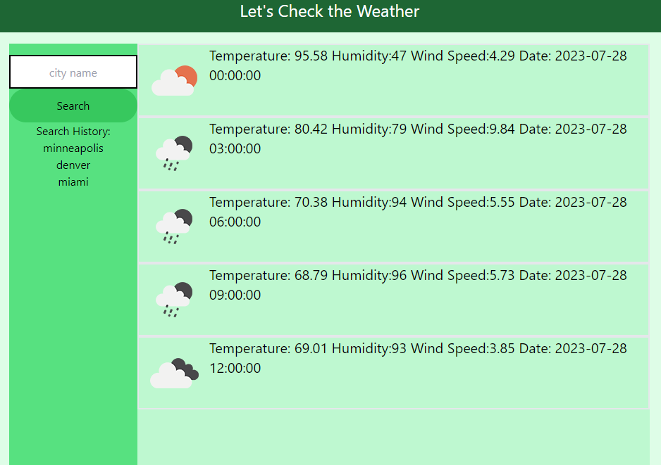

# weather-dashboard
Five day weather forecast using OpenWeather API

## Description

Search for weather information from user input city, using OpenWeather. Stores information in local storage for future reference

## Usage

Input city into search bar and generate forcast for that city. Use the list below to recall cities saved in local storage.

